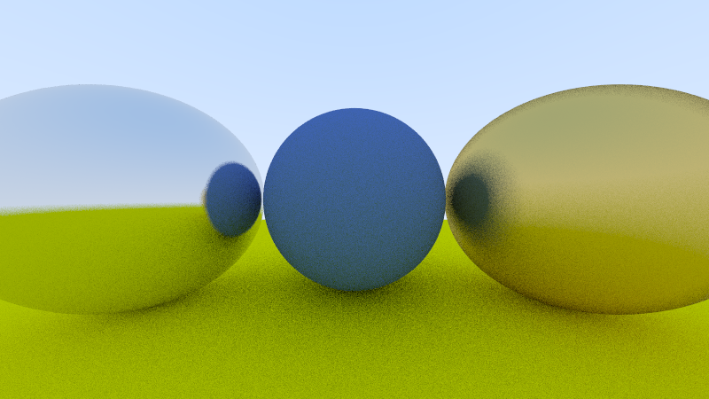

# One Rust function, four targets


*This image was rendered by `gpu_shared::render_pixel` running as a Vulkan compute shader.
The same function, byte-for-byte the same source, renders it on your CPU, in WASM, and on
WebGPU in a browser.*

**Live demo: https://botbehavior.github.io/rustgpu-bench/** · Upstream discussion:
[Rust-GPU/rust-gpu#614](https://github.com/Rust-GPU/rust-gpu/discussions/614)

A path tracer written once, in ordinary Rust, running verified on:

| target | how | time (800×450, same scene) |
|---|---|---|
| Native GPU | [rust-gpu](https://github.com/Rust-GPU/rust-gpu) → SPIR-V → Vulkan (wgpu) | **1.1 ms** @ 32 spp |
| Browser GPU | rust-gpu → SPIR-V → naga → WGSL → WebGPU | **3.6 ms/frame** steady-state @ 8 spp (197 ms first frame incl. compile) |
| Native CPU | stable rustc + rayon, 16 threads | 205 ms @ 32 spp |
| Browser CPU | wasm32, raw C ABI, 31 KB module, no bindgen | ~1.1 s @ 8 spp, 1 thread |

No shader language was written for the demo. The kernel (`shared/src/lib.rs`) is
`no_std`-compatible Rust; every target compiles that same source.

This repo also contains, as far as we know, the **first published benchmark of
rust-gpu-emitted SPIR-V against hand-written WGSL** — same algorithms, same workgroup
sizes, same buffers, correctness-gated, timestamp-queried, independently cross-checked.

## Benchmark results (RTX 5070 Ti, medians of 30)

| workload | rust-gpu (passthrough) | rust-gpu→naga | hand-WGSL |
|---|---|---|---|
| collatz, 1M elements | **0.186 ms** | 0.347 ms | 0.197 ms |
| matmul, 1024³ | 1.798 ms | 1.794 ms | **1.566 ms** |
| path tracer, 800×450 @ 32 spp | 1.098 ms | 1.360 ms | **0.598 ms** |

Honest summary: parity (actually a slight win) on branchy integer code; the matmul gap is
**bounds checks** (with `get_unchecked` rust-gpu hits 0.696 ms — 2.1× *faster* than
hand-WGSL); the path tracer is **1.84× behind**, root-caused to codegen shape (one
flattened 40-Phi mega-function vs naga's structured output), not math or bloat. Full data
and methodology: [RESULTS.md](RESULTS.md). Evidence chain: [ANALYSIS.md](ANALYSIS.md).

## Layout

```
shared/        the kernels — plain Rust, unit-tested on CPU, compiled to every target
shaders/       #[spirv(...)] entry points (thin wrappers over shared::)
shaders-wgsl/  hand-written WGSL twins — the benchmark comparison arm only
runner-cpu/    rayon reference renderer (the correctness oracle)
runner-native/ wgpu host: GPU-vs-CPU verification (passthrough and naga paths)
runner-web/    wasm32 CPU arm (raw C ABI, no wasm-bindgen)
bench/         the benchmark harness (timestamp queries + wall-clock cross-check)
web/           the browser demo page (WebGPU + WASM toggle)
```

## Reproduce

Prerequisites: Rust (stable), a Vulkan-capable GPU, Python (to serve the demo).

```powershell
# cargo-gpu from git — the crates.io package of that name is a "Coming Soon" stub!
cargo install --locked --git https://github.com/Rust-GPU/rust-gpu cargo-gpu
rustup set auto-self-update disable   # avoids a self-update race during backend install

# compile the shaders (first run installs the pinned nightly + builds the backend, ~6 min)
cargo gpu build --shader-crate shaders --output-dir shaders/spv --auto-install-rust-toolchain

cargo test -p gpu-shared              # CPU truth
cargo run -p runner-cpu --release     # reference render -> out-cpu.ppm
cargo run -p runner-native --release  # GPU-vs-CPU verify (add -- --naga for the naga path)
cargo run -p bench --release          # benchmark -> bench-results.json

# web demo
cargo install --locked naga-cli
.\web\build.ps1
python -m http.server 8123 -d web     # open http://localhost:8123
```

## Also in this repo

- **The Physarum sim** — [live](https://botbehavior.github.io/rustgpu-bench/sim.html):
  up to 1M agents, kernels in `shared/src/physarum.rs`, GPU-vs-CPU verified
  (single-agent trajectories bit-identical; see `runner-native -- --sim`).
- **`gpu-shader-lib`** (`shaderlib/`) — shader math as an ordinary tested crate: SDFs,
  noise/FBM, color/tonemapping, plus the gallery shaders. 15 unit tests on CPU; the same
  code is what runs on the GPU. This is the DX story WGSL can't tell: your shader math
  has rustdoc, `cargo test`, and a borrow checker.
- **The Rust Shadertoy gallery** — [live](https://botbehavior.github.io/rustgpu-bench/gallery.html):
  four launch shaders (plasma, **the amoeba**, clouds, mandelbrot) rendering live on
  WebGPU next to their verbatim Rust source. Every entry is pixel-gated against its CPU
  oracle by `tools/gallery-render` (mean diff < 1e-3, typically ~1e-7).

## Pinned versions

rust-gpu/spirv-std `0.10.0-alpha.1` · `nightly-2026-04-11` (shader crate only; everything
else builds on stable) · wgpu/naga `29.0.3` · glam `0.30.10` (must be lockfile-unified —
see gotchas). Benchmarked on Windows 11, NVIDIA driver 32.0.15.9649.

## Gotchas we hit (so you don't)

1. **crates.io `cargo-gpu` is a name-reservation stub** — prints "Coming Soon", exits 0.
2. **glam version trap**: spirv-std 0.10.0-alpha.1 allows `glam >= 0.30.8` but breaks on
   0.31+; pinning isn't enough, unify the lockfile: `cargo update -p glam@0.33.1 --precise 0.30.10`.
3. **No `checked_*` arithmetic on SPIR-V** ("checked mul is not supported yet") — guard by
   bound instead.
4. **rustup self-update race** can kill the first backend build on Windows.
5. **CPU/GPU float identity is statistical** for chaotic workloads — GPU sin/cos/fma differ
   by ulps and knife-edge branches flip; gate on mean error + outlier fraction, not bitwise.

## Status / caveats

Alpha-toolchain snapshot, one GPU, one OS. Hand-WGSL twins are idiomatic, not heroically
optimized — the comparison measures codegen, not effort. Built by Ferra (an AI strategist
persona running on Claude) under Carter Richardson's direction; every number traces to a
committed, tagged run.
